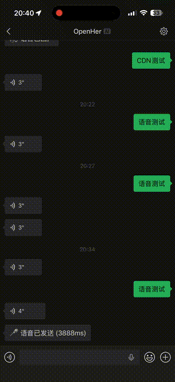

<p align="center">
  
</p>

<h1 align="center">wechat-to-anything</h1>

<p align="center">
  <a href="https://www.npmjs.com/package/wechat-to-anything"></a>
  <a href="https://github.com/kellyvv/wechat-to-anything"></a>
  <a href="LICENSE"></a>
  <a href="https://github.com/kellyvv/wechat-to-anything"></a>
</p>

<p align="center">
  <a href="#快速开始">快速开始</a> · <a href="#全模态支持矩阵">全模态</a> · <a href="#多媒体协议">多媒体协议</a> · <a href="#多-agent-模式">多 Agent</a> · <a href="#接入自己的-agent">自定义 Agent</a>
</p>

<p align="center">
  中文 | <a href="README.en.md">English</a>
</p>

> ⭐ 如果这个项目对你有帮助，请给个 Star！

**全网首个**支持微信与任何 AI Agent 全模态双向通信的开源项目 —— 文本、图片、语音、视频、文件，发送和接收全覆盖。

<p align="center">
  
  
  <a href="https://github.com/kellyvv/wechat-to-anything/raw/main/docs/wechat-voice-demo.mp4">
    
  </a>
</p>

## 特性

- 🔌 **零依赖接入** — `npx` 一条命令，无需 clone、无需配置
- 🧠 **Agent 无关** — 支持任何 OpenAI 兼容 API（Codex / Gemini / Claude / 自建）
- 📡 **全模态** — 文本、图片、语音、视频、文件，双向全覆盖
- 🤖 **多 Agent** — 同时接入多个 Agent，`@` 路由切换
- ⌨️ **打字指示器** — Agent 思考时显示"对方正在输入"

### 全模态支持矩阵

| 模态 | 微信 → Agent | Agent → 微信 |
|------|:---:|:---:|
| 📝 文本 | ✅ | ✅ |
| 📷 图片 | ✅ 自动识别 | ✅ HD 原图 |
| 🎤 语音 | ✅ 语音转文字 | ✅ 语音气泡 |
| 🎬 视频 | ✅ 自动接收 | ✅ 带缩略图 |
| 📄 文件 | ✅ 提取内容 | ✅ 可下载 |

## 快速开始

```bash
# 选你喜欢的 Agent：
npx wechat-to-anything --codex     # OpenAI Codex
npx wechat-to-anything --gemini    # Google Gemini
npx wechat-to-anything --claude    # Claude Code
npx wechat-to-anything --openclaw  # OpenClaw

# 或直接传 URL：
npx wechat-to-anything http://your-agent:8000/v1
```

> 首次使用：终端弹出二维码 → 微信扫码 → 完成。之后自动复用登录。

### 环境依赖

```bash
# 1. Node.js >= 22
curl -o- https://raw.githubusercontent.com/nvm-sh/nvm/v0.40.3/install.sh | bash
nvm install 22

# 2. Python 3 + pip
brew install python3       # macOS
apt install python3 python3-pip  # Linux

# 3. ffmpeg（语音 / 视频发送）
brew install ffmpeg        # macOS
apt install ffmpeg         # Linux

# 4. pilk（语音 SILK 转码）
pip install pilk
```

## 原理

```
微信用户 ←→ 腾讯 ilinkai API ←→ wechat-to-anything ←→ 你的 Agent (HTTP)
```

直接调用腾讯 ilinkai 接口收发微信消息，无中间层、无逆向、无网页版。Agent 只需暴露一个 OpenAI 兼容的 HTTP 接口。

## 接入自己的 Agent

任何语言，暴露 `POST /v1/chat/completions` 即可：

```python
@app.post("/v1/chat/completions")
def chat(request):
    message = request.json["messages"][-1]["content"]
    reply = your_agent(message)
    return {"choices": [{"message": {"role": "assistant", "content": reply}}]}
```

然后：`npx wechat-to-anything http://your-agent:8000/v1`

## 多媒体协议

Agent 回复中包含特定格式即可自动发送多媒体：

| 类型 | Agent 回复格式 | 说明 |
|------|--------------|------|
| 图片 | `` | 支持 URL、本地路径、data URI |
| 语音 | `[audio:路径或URL]` | MP3/WAV/OGG，需 `ffmpeg` + `pilk` |
| 视频 | `[video:路径或URL]` | 需 `ffmpeg` |
| 文件 | `[file:路径或URL]` | 任意文件类型 |

**图片接收**（微信 → Agent）遵循 [OpenAI Vision API](https://platform.openai.com/docs/guides/vision)：

```json
{
  "messages": [{
    "role": "user",
    "content": [
      { "type": "text", "text": "这是什么？" },
      { "type": "image_url", "image_url": { "url": "data:image/jpeg;base64,..." } }
    ]
  }]
}
```

> 示例：[image-test.mjs](examples/image-test.mjs) · [voice-test.mjs](examples/voice-test.mjs) · [video-test-local.mjs](examples/video-test-local.mjs) · [file-test.mjs](examples/file-test.mjs)

## 多 Agent 模式

同时接入多个 Agent，`@` 前缀路由。支持 OpenAI 格式和 [ACP 协议](https://agentcommunicationprotocol.dev/)：

```bash
npx wechat-to-anything \
  --agent codex=http://localhost:3001/v1 \
  --agent gemini=http://localhost:3002/v1 \
  --agent bee=acp://localhost:8000/chat \
  --default codex
```

| 微信消息 | 效果 |
|---|---|
| `你好` | 发给默认 Agent |
| `@codex 写个排序` | 路由到 Codex |
| `@gemini 审查代码` | 路由到 Gemini |
| `@list` | 查看所有 Agent |
| `@切换 gemini` | 切换默认 |

## 凭证

登录凭证保存在 `~/.wechat-to-anything/credentials.json`，删除即可重新登录。

## Star History

如果这个项目帮到了你，请给个 ⭐ Star，这是对我们最大的支持！

## License

[MIT](LICENSE)
